# Event Creation Workflow

[中文](./event-creation-workflow.zh.md) | English

> This document is an internal workflow for Beta College SDC.

> [!IMPORTANT]
> If you are not yet familiar with GitHub Issues, Sub-issues, branches, Pull Requests, or web editing, read [Quick Help for GitHub Beginners and New Members](https://github.com/BETA-SDC/community/blob/main/docs/resources/README.md#L10-L15) before using this workflow to create an activity.

This document is based on [BETA-SDC/event-proposal#5](https://github.com/BETA-SDC/event-proposal/issues/5). It standardizes the basic process from proposing an activity, preparing materials, collaborating on branches, and archiving final information.

## Table of Contents

- [Overview](#overview)
  - [Flowchart](#flowchart)
- [Scope](#scope)
- [Principles](#principles)
- [Standard Workflow](#standard-workflow)
  - [1. Propose an Activity or Idea](#1-propose-an-activity-or-idea)
  - [2. Notify Relevant People](#2-notify-relevant-people)
  - [3. Split Tasks and Assign Members](#3-split-tasks-and-assign-members)
  - [4. Issue Title Rules](#4-issue-title-rules)
  - [5. Issue Label Rules](#5-issue-label-rules)
  - [6. Create a Branch from the Issue](#6-create-a-branch-from-the-issue)
  - [7. Prepare Activity Materials on the Branch](#7-prepare-activity-materials-on-the-branch)
  - [8. Submit a Pull Request](#8-submit-a-pull-request)
  - [9. Send Notices and Archive the Copy](#9-send-notices-and-archive-the-copy)
  - [10. Wrap Up After the Activity](#10-wrap-up-after-the-activity)
- [Pre-Submission Checklist](#pre-submission-checklist)
- [FAQ](#faq)
  - [Can I open an Issue before the idea is fully confirmed?](#can-i-open-an-issue-before-the-idea-is-fully-confirmed)
  - [Does a short group message need to be archived?](#does-a-short-group-message-need-to-be-archived)
  - [Can one branch handle multiple activities?](#can-one-branch-handle-multiple-activities)
  - [What if information needs to change after the Pull Request is merged?](#what-if-information-needs-to-change-after-the-pull-request-is-merged)

## Overview

An activity or collaborative item usually moves forward in this order:

1. **Propose the item:** Create a main Issue in the [event-proposal repository](https://github.com/BETA-SDC/event-proposal), explaining the background, owner, relevant people, and key dates.
2. **Clarify collaboration:** Discuss the plan in the main Issue, notify relevant members, and split executable work into Sub-issues.
3. **Assign tasks:** Create task Sub-issues with the `[task]` type title, assign them to members, and add suitable labels.
4. **Prepare materials:** Create the corresponding branch from the main Issue and prepare the proposal, notification copy, poster information, budget, materials, and other activity files on that branch.
5. **Submit for review:** Use a Pull Request to collect the changes, link the original Issue, and merge after the owner reviews and confirms.
6. **Send and archive:** After emails, group notices, or publicity copy are officially sent, create a `[message]` Sub-issue to archive the full content and sending information.
7. **Wrap up:** After the activity, add participation information, media locations, review notes, and reusable materials.

The main Issue keeps the overall context for the activity or item. Sub-issues track specific tasks, message archives, and wrap-up work. Branches and Pull Requests keep file changes reviewable and traceable.

### Flowchart

```mermaid
flowchart LR
    start(["Activity idea<br/>Collaboration item"])

    subgraph issue["Issue Entry"]
        main["Main Issue<br/>[event] / [improvement]"]
        discuss["Discuss plan<br/>Notify relevant members"]
    end

    subgraph work["Execution"]
        task["Task Sub-issue<br/>[task] + assignee"]
        branch["Corresponding branch"]
        materials["Activity materials<br/>Proposal / Copy / Poster / Budget"]
    end

    subgraph review["Review and Merge"]
        pr["Pull Request"]
        check{"Owner confirms"}
        merge["Merge changes"]
    end

    subgraph archive["Archive and Wrap-up"]
        send["Officially send"]
        message["Message archive<br/>[message]"]
        wrap["Wrap-up<br/>[wrap-up]"]
    end

    start --> main --> discuss --> task
    task --> branch --> materials --> pr --> check
    check -- Revise --> materials
    check -- Approved --> merge --> send --> message --> wrap
    task -. Progress update .-> main
    message -. Archive link .-> main
    wrap -. Review notes .-> main

    classDef entry fill:#eef6ff,stroke:#3b82f6,color:#0f172a
    classDef workStyle fill:#f7fee7,stroke:#65a30d,color:#1a2e05
    classDef reviewStyle fill:#fff7ed,stroke:#f97316,color:#431407
    classDef archiveStyle fill:#f5f3ff,stroke:#8b5cf6,color:#1e1b4b
    class main,discuss entry
    class task,branch,materials workStyle
    class pr,check,merge reviewStyle
    class send,message,wrap archiveStyle
```



## Scope

This workflow applies to SDC-related activities, publicity materials, recruitment information, notification copy, and other items that require collaboration among multiple people. The goal is to ensure that every activity has a clear source, owner, edit history, and final record.

## Principles

- **Open an Issue before starting work.** When there is an activity or idea, open an Issue in the relevant repository first and document the idea, background, owner, and people who may be involved.
- **Use Sub-issues for concrete tasks.** Once an activity enters execution, split poster design, copywriting, venue, materials, on-site execution, and other clear tasks into Sub-issues, then assign them to members.
- **Keep Sub-issue titles consistent.** Titles should use a fixed prefix, activity name, and concrete item so they are easy to identify in Issue lists, search results, and main Issue checklists.
- **Label Issues and Sub-issues.** Labels distinguish activity main threads, task assignments, message archives, and wrap-up work, making later filtering and review easier.
- **Make all file changes on branches.** Do not edit activity materials directly on the main branch, so collaborators do not overwrite each other.
- **Merge through Pull Requests.** Pull Requests are where review, discussion, and final confirmation happen.
- **Archive sent information.** Once emails, group messages, recruitment copy, or other official notices are sent, back them up in a Sub-issue and add the corresponding `message` label.

## Standard Workflow

### 1. Propose an Activity or Idea

When a new activity idea, collaboration need, or item requiring a record appears, create an Issue in the [event-proposal repository](https://github.com/BETA-SDC/event-proposal).

The Issue should include at least:

- Activity name or tentative name
- Purpose and background
- Expected time, location, and format
- Initial owner
- People who need to discuss or collaborate
- Known key deadlines
- Whether posters, registration forms, group notices, email notices, or other materials are needed

If the idea is not mature yet, it is still fine to open an Issue for discussion. The purpose of an Issue is not to prove that the plan is perfect, but to give the item a traceable entry point.

### 2. Notify Relevant People

After creating the Issue, use `@username` to notify members who may be relevant. These usually include:

- Activity owner
- People who need to provide resources or approval
- People who need to make posters, posts, registration forms, or other publicity materials
- People who need to handle on-site arrangements, purchasing, photography, or later organization

If the discussion involves clear task assignments, you may first write a checklist in the Issue. Once the work enters execution, split concrete tasks into Sub-issues and assign them to members for tracking and follow-up.

### 3. Split Tasks and Assign Members

Once an activity enters execution, the owner should split independently actionable work from the main Issue discussion into Sub-issues and assign them to corresponding members. Suitable Sub-issues include:

- Poster, post, registration form, and other publicity material production
- Email, group notice, official account copy, and other text material preparation
- Venue booking, equipment confirmation, purchasing, or reimbursement follow-up
- Guest, host, photographer, and on-site execution arrangements
- Post-activity media organization, review notes, or website showcase updates

Each Sub-issue should explain:

- Task content and deliverables
- Owner or executor, assigned in GitHub
- Deadline or expected collection time
- Required materials, links, templates, or prerequisite confirmations
- Where the result should be submitted, such as a Pull Request, comment attachment, shared document, or directory

> [!IMPORTANT]
> If the task is poster production or another publicity material, create a Sub-issue under the corresponding activity main Issue according to the standard workflow, and @ the activity owner or publicity owner in the Sub-issue. The Sub-issue should explain the poster purpose, deadline, publishing channel, required registration link, whether specific images are required, and how image materials should be used. If images, QR codes, or reference images already exist, attach them to the Sub-issue so materials are not left only in chat records.

Task Sub-issue titles should use this format:

```text
[task] Activity Name - Task Name
```

Where:

- `[task]` means this is a task that needs execution and follow-up
- `Activity Name` should match the activity name in the main Issue
- `Task Name` should describe a concrete deliverable or action

Examples:

```text
[task] Math Help Room - Create registration form
[task] Group Birthday Ceremony - Confirm material purchase
```

The main Issue may keep an overall checklist linked to the corresponding Sub-issues. This lets the owner see the full progress in the main Issue while detailed discussion stays in each Sub-issue.

### 4. Issue Title Rules

All Issues and Sub-issues should use English half-width square brackets as type prefixes. The prefix indicates the nature of the item. Owner, status, priority, and similar information should be managed through assignees, labels, projects, or milestones instead of title prefixes.

General title rules:

- Use English half-width square brackets as the type prefix, such as `[event]`, `[task]`, and `[message]`
- Add one space after the prefix, then write the activity or item name
- When a title actually contains multiple fields, use ` - ` to separate them, such as in task, message archive, and wrap-up Sub-issues. A main activity Issue usually contains only the activity name and does not need an extra separator
- Keep the `Activity Name` consistent for the same activity; do not mix abbreviations, Chinese names, and English names
- Make item names specific to deliverables or checkable results, avoiding vague words such as “follow up,” “handle,” or “prepare”
- Use `YYYY-MM-DD` for dates

Current Issue title types:

| Type | Use | Title Format |
| --- | --- | --- |
| `[event]` | Main activity Issue | `[event] Activity Name` |
| `[improvement]` | Internal process, regulation, tool, or collaboration improvement proposal | `[improvement] Improvement Item Name` |
| `[task]` | Concrete task assigned to members | `[task] Activity Name - Task Name` |
| `[message]` | Archive of an officially sent notice or publicity copy | `[message] Activity Name - Channel - YYYY-MM-DD` |
| `[wrap-up]` | Activity review, media organization, or wrap-up item | `[wrap-up] Activity Name - Wrap-up Item` |
| `[question]` | Temporary question, information to confirm, or discussion item | `[question] Question Summary` |
| `[docs]` | Maintenance, correction, addition, or organization of existing documentation | `[docs] Document Name or Maintenance Item` |

Difference between `[improvement]` and `[docs]`:

- If the core of the Issue is “how should we work in the future,” use `[improvement]`
- If the core of the Issue is “how should this document be changed,” use `[docs]`
- If an improvement proposal eventually requires documentation changes, the main Issue still uses `[improvement]`; concrete document changes can be handled as a `[task]` Sub-issue or Pull Request
- If the work only fixes typos, adds links, organizes formatting, or syncs an existing process without changing how the organization works, use `[docs]`

Examples:

```text
[event] Math Help Room
[improvement] Establish standard activity creation workflow
[improvement] Standardize activity task assignment
[task] Math Help Room - Create registration form
[message] Math Help Room - Email notice - 2026-09-09
[wrap-up] Group Birthday Ceremony - Organize photo materials
[question] Should we standardize the registration form template
[docs] Update activity workflow instructions
[docs] Fix links in media delivery guidelines
```

If one Sub-issue includes both a task and a message, name it according to its main purpose. In general, preparing copy is `[task]`, while archiving copy after official sending is `[message]`.

### 5. Issue Label Rules

Issues and Sub-issues should be labeled according to their purpose. Use a small and stable label set rather than creating a new label for every activity.

Recommended labels:

| Label | Applies To | Purpose |
| --- | --- | --- |
| `event` | Main Issue | Main entry for an activity or activity-related item |
| `internal-improvement` | Main Issue | Internal process, collaboration method, regulation, or tool improvement proposal |
| `task` | Sub-issue | Concrete task assigned to a member |
| `message` | Sub-issue | Archive of an officially sent message or copy |
| `mail` | Sub-issue | Message or task related to email |
| `group-notice` | Sub-issue | Message or task related to WeChat, Feishu, or other group notices |
| `notification-poster` | Sub-issue | Task related to posters, posts, or publicity materials |
| `wrap-up` | Main Issue or Sub-issue | Post-activity review, media organization, or wrap-up item |

Label rules:

- Main activity Issues should at least add `event`
- Internal improvement proposals should at least add `internal-improvement`
- If an Issue is mainly about maintaining existing documentation, add `documentation`
- If an internal improvement proposal eventually requires documentation changes, the main Issue does not need an extra `documentation` label; the related documentation Pull Request or documentation maintenance Issue may use `documentation`
- Task assignment Sub-issues should at least add `task`
- Message archive Sub-issues should at least add `message`
- Email archives should use `message` + `mail`
- Group notice archives should use `message` + `group-notice`
- Poster, post, and registration publicity material tasks should use `task` + `notification-poster`
- Post-activity review or media organization should use `wrap-up`

If an Issue is a temporary question, information to confirm, or a request for extra help, GitHub's default `question` or `help wanted` label may be used temporarily. After confirmation, add the corresponding activity workflow label or `internal-improvement`.

### 6. Create a Branch from the Issue

After an activity enters execution, create the corresponding branch from the Issue page. The branch name should be short, recognizable, and related to the activity.

Recommended format:

```text
two-digit-issue-number-activity-short-name
```

Issue numbers should use two digits. If the number has fewer than two digits, add a leading `0`, such as `05`. If old branches or references use one-digit numbers, correct them to two digits during later cleanup.

Examples:

```text
05-standard-workflow
12-math-help-room
18-group-birthday
```

If using the GitHub web interface, create the branch from the Issue sidebar or development section. If using local Git, still make sure the branch corresponds to the Issue and link the original Issue in the later Pull Request.

### 7. Prepare Activity Materials on the Branch

All activity-related files should be completed on the activity branch, including but not limited to:

- Activity proposal
- Poster information form
- Registration form instructions
- Email or group notice drafts
- Budget, materials, venue, and responsibility records
- Sign-in records, registration checks, and attendance statistics
- Photography, publicity, publishing, or review materials

> [!IMPORTANT]
> When a poster is needed, fill in complete information using the [poster information template](https://github.com/BETA-SDC/event-proposal/blob/main/template-for-poster-information.md) in the [event-proposal repository](https://github.com/BETA-SDC/event-proposal). Include the activity title, time and location, organizer, registration method, registration link, contact person, display copy, and other information that must appear on the poster. If the poster needs specific images, explain the image content, source, placement, or style requirements in the poster information form, and make sure the original images or references have been attached to the corresponding Sub-issue.

File locations should follow the repository's directory structure. For example, activity proposals and poster information usually go under the school-year directory in the [event-proposal repository](https://github.com/BETA-SDC/event-proposal/tree/main/2026-2027), using a folder name based on the activity date, series code, two-digit session number, and necessary topic. See example files [proposal.md](https://github.com/BETA-SDC/event-proposal/blob/main/2026-2027/2026-09-09-MATH-HELP-ROOM-01/proposal.md) and [poster-information.md](https://github.com/BETA-SDC/event-proposal/blob/main/2026-2027/2026-09-09-MATH-HELP-ROOM-01/poster-information.md).

Recommended activity folder naming format:

```text
YYYY-MM-DD-SERIES-two-digit-session[-specific-topic]
```

Series activities use the date, an uppercase series code, and a two-digit session number, such as `2026-09-29-BETA-MEET-01-the-field-experience-of-an-ecologist` or `2026-09-09-MATH-HELP-ROOM-01`. The topic may be omitted when the series name and session number are already clear. Non-series activities may use `YYYY-MM-DD-specific-topic`, such as [2026-09-19-self-study-check-in](https://github.com/BETA-SDC/event-proposal/tree/main/2026-2027/2026-09-19-self-study-check-in).

Examples:

- [2026-09-09-MATH-HELP-ROOM-01](https://github.com/BETA-SDC/event-proposal/tree/main/2026-2027/2026-09-09-MATH-HELP-ROOM-01)
- [2026-09-16-GROUP-BIRTHDAY-01-2026-fall](https://github.com/BETA-SDC/event-proposal/tree/main/2026-2027/2026-09-16-GROUP-BIRTHDAY-01-2026-fall)

For complete in-repository naming rules, see the [event-proposal Repository File Naming Rules](./event-proposal-repo-naming-regulation.md).

During collaboration, write important decisions back to the Issue or relevant Markdown files rather than leaving them only in chat records.

### 8. Submit a Pull Request

After activity materials are ready for review, submit a Pull Request. The Pull Request should explain:

- Linked Issue
- Which activity materials were added or modified
- Which information has been confirmed and which still needs owner confirmation
- Whether it involves emails, group messages, or other public copy that has not yet been sent
- Whether special checks are needed for time, location, budget, guest information, or registration method

Pull Request titles should include the activity name so they can be found later.

Examples:

```text
Add workflow proposal for activity setup
Add poster information for Math Help Room
Update group birthday ceremony materials
```

After the owner reviews the Pull Request, they may request changes. Merge only after revisions are complete and the content is confirmed.

### 9. Send Notices and Archive the Copy

After emails, group messages, registration notices, recruitment copy, or other notices are officially sent, create a Sub-issue under the original Issue for archiving.

Here, “archive” means creating a new Sub-issue under the corresponding activity main Issue according to the message archive rules, then copying the actually sent information into it in full. The Sub-issue is not the sending channel itself; it is part of the activity record used to confirm what was sent, when, through which channel, and by whom.

The Sub-issue should include:

- Full content of the sent copy
- Sending channel, such as email, WeChat group, Feishu group, or official account backend
- Sending time
- Sender or owner
- Screenshots, links, or recipient scope if needed

The Sub-issue should add the corresponding `message` label. This makes it possible to find “what exactly was sent at that time” later without searching chat records or personal mailboxes.

Message archive Sub-issue titles should use this format:

```text
[message] Activity Name - Channel - YYYY-MM-DD
```

Examples:

```text
[message] Math Help Room - Email notice - 2026-09-09
[message] Group Birthday Ceremony - WeChat group notice - 2026-09-16
```

### 10. Wrap Up After the Activity

After the activity ends, the owner should add the following information as appropriate:

- Whether the activity was held as scheduled
- Number of participants or general feedback
- Registration, sign-in, and actual attendance statistics
- Location of photos, videos, or other materials
- Issues that need review
- Reusable templates, copy, or workflows

If the activity has registration, sign-in, on-site additions, or attendance statistics, follow the [Sign-In Record Guidelines](./sign-in-record-guidelines.md) and create a `sign-in/` subdirectory under the activity materials directory. Save `README.md`, `00-summary.csv`, and categorized list CSV files there. See the [group birthday ceremony sign-in example](https://github.com/BETA-SDC/event-proposal/tree/main/2026-2027/2026-09-16-GROUP-BIRTHDAY-01-2026-fall/sign-in).

> [!IMPORTANT]
> Activity photos and videos should be uploaded to the [Beta College Album](https://westlakeu.sharepoint.com/sites/beta-college/Album/Forms/AllItems.aspx?viewid=f4bff7b2%2Ddd12%2D43eb%2Da665%2Dd945dfd194c3), with folders organized by date and activity name. Do not leave photos or videos only in chat records or on personal devices.

If the activity produces website showcase materials, media assets, or later publicity needs, organize the materials according to the [Media Capture Guidelines](./media-capture-guidelines.md).

## Pre-Submission Checklist

Before merging a Pull Request, check:

- [ ] Original Issue explains the activity background, owner, and relevant people
- [ ] Original Issue title uses the standard type prefix
- [ ] Original Issue has the `event` label
- [ ] Concrete tasks have been split into Sub-issues and assigned to members
- [ ] Sub-issue titles follow the standard format
- [ ] Sub-issues have labels such as `task`, `message`, or other corresponding labels
- [ ] Poster or publicity material tasks are assigned to executors and @ the activity owner or publicity owner
- [ ] Poster information follows the template, registration links and image use notes are complete, and related images or QR codes are attached to the Sub-issue
- [ ] A corresponding branch has been created from the Issue and is being used
- [ ] Activity materials are in the correct directory
- [ ] Key information such as time, location, organizer, and registration method has been confirmed
- [ ] Public copy such as posters, emails, and group notices has been confirmed by the owner
- [ ] Pull Request links the original Issue
- [ ] Officially sent messages have been archived in Sub-issues
- [ ] Message archive Sub-issues have the `message` label
- [ ] If there is registration or sign-in, sign-in records have been organized according to the [Sign-In Record Guidelines](./sign-in-record-guidelines.md) and placed under `sign-in/`
- [ ] Activity photos and videos have been uploaded to the [Beta College Album](https://westlakeu.sharepoint.com/sites/beta-college/Album/Forms/AllItems.aspx?viewid=f4bff7b2%2Ddd12%2D43eb%2Da665%2Dd945dfd194c3)
- [ ] Materials and review information that need to be saved after the activity have been recorded

## FAQ

### Can I open an Issue before the idea is fully confirmed?

Yes. Issues can be used for early discussion and do not require a complete plan from the start. If an idea may need multiple people, follow-up tracking, or activity materials later, it is worth opening an Issue.

### Does a short group message need to be archived?

If the message affects activity arrangements, registration, time and location, participant notification, or external publicity, it should be archived. Casual chat does not need archiving; official notices do.

### Can one branch handle multiple activities?

Not recommended. One activity or a tightly related group of tasks should correspond to one Issue and one branch, which makes later review and search clearer.

### What if information needs to change after the Pull Request is merged?

Explain the change under the corresponding Issue, then open a new branch and Pull Request if needed. Do not rely only on verbal changes in chat, especially for time, location, registration method, or public copy.
