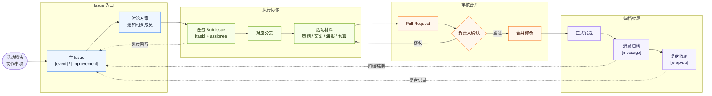

# 活动建立规范流程

> 本文档属于 β书院 SDC 组织内部工作流程。

本文档整理自 [BETA-SDC/event-proposal#5](https://github.com/BETA-SDC/event-proposal/issues/5)，用于统一活动从想法提出、资料准备、分支协作到信息归档的基本流程。

## 目录

- [流程概览](#流程概览)
  - [流程图](#流程图)
- [适用范围](#适用范围)
- [基本原则](#基本原则)
- [标准流程](#标准流程)
  - [1. 提出活动或设想](#1-提出活动或设想)
  - [2. 通知相关人员](#2-通知相关人员)
  - [3. 拆分任务并分配成员](#3-拆分任务并分配成员)
  - [4. Issue 标题规范](#4-issue-标题规范)
  - [5. Issue 标签规范](#5-issue-标签规范)
  - [6. 从 Issue 创建分支](#6-从-issue-创建分支)
  - [7. 在分支中准备活动材料](#7-在分支中准备活动材料)
  - [8. 提交 Pull Request](#8-提交-pull-request)
  - [9. 发送通知并归档文案](#9-发送通知并归档文案)
  - [10. 活动结束后的收尾](#10-活动结束后的收尾)
- [提交前检查](#提交前检查)
- [常见问题](#常见问题)
  - [想法还不确定，可以先开 Issue 吗？](#想法还不确定可以先开-issue-吗)
  - [只是发一条群消息，也需要归档吗？](#只是发一条群消息也需要归档吗)
  - [分支里可以同时处理多个活动吗？](#分支里可以同时处理多个活动吗)
  - [Pull Request 合并后还发现信息要改怎么办？](#pull-request-合并后还发现信息要改怎么办)

## 流程概览

一次活动或协作事项通常按以下顺序推进：

1. **提出事项：** 在 `event-proposal` 仓库中新建主 Issue，说明活动背景、负责人、相关人员和关键时间。
2. **明确协作：** 在主 Issue 中讨论方案，通知相关成员，并把需要执行的工作拆成 Sub-issue。
3. **分配任务：** 使用 `[task]` 类型标题创建任务类 Sub-issue，assign 给对应成员，并添加合适的标签。
4. **准备材料：** 从主 Issue 创建对应分支，在分支中准备策划案、通知文案、海报信息、预算、物资和其他活动材料。
5. **提交审核：** 通过 Pull Request 汇总修改，关联原 Issue，并由负责人审核确认后合并。
6. **发送并归档：** 正式发送邮件、群聊通知或宣传文案后，使用 `[message]` 类型 Sub-issue 归档完整内容和发送信息。
7. **活动收尾：** 活动结束后补充参与情况、素材位置、复盘记录和后续可复用内容。

主 Issue 用来保存活动或事项的整体上下文；Sub-issue 用来跟踪具体任务、消息归档和收尾工作；分支和 Pull Request 用来保存可审核、可追溯的文件修改。

### 流程图



## 适用范围

本流程适用于 SDC 相关活动、宣传材料、招募信息、通知文案和其他需要多人协作推进的事项。目标是让每个活动都有清晰的来源、负责人、修改历史和最终记录。

## 基本原则

- **先开 Issue，再开始做。** 有活动或其他设想时，先在相关仓库开 Issue，把想法、背景、负责人和可能相关的人员写清楚。
- **具体任务用 Sub-issue 分配。** 当活动进入执行阶段，把海报、文案、场地、物资、现场执行等明确任务拆成 Sub-issue，并 assign 给对应成员。
- **Sub-issue 标题要统一。** 标题应使用固定前缀、活动名称和具体事项，便于在 Issue 列表、搜索结果和主 Issue checklist 中快速识别。
- **Issue 和 Sub-issue 要打标签。** 标签用于区分活动主线、任务分配、消息归档和活动收尾，方便后续筛选和复盘。
- **所有修改都在分支中完成。** 不直接在主分支上改活动材料，避免多人协作时互相覆盖。
- **完成后通过 Pull Request 合并。** Pull Request 是审核、讨论和确认最终版本的地方。
- **发出的信息要归档。** 邮件、群聊消息、招募文案等一旦正式发送，需要在 Sub-issue 中备份，并打上对应的 `message` 标签。

## 标准流程

### 1. 提出活动或设想

当出现新的活动想法、协作需求或需要记录的事项时，在 `event-proposal` 仓库中新建 Issue。

Issue 中建议至少包含以下信息：

- 活动名称或暂定名称
- 活动目的和背景
- 预计时间、地点和形式
- 初步负责人
- 需要参与讨论或协作的人员
- 已知的关键截止时间
- 是否需要海报、报名表、群聊通知、邮件通知等材料

如果想法还不成熟，也可以先开 Issue 进行讨论。Issue 的作用不是证明方案已经完美，而是让事情有一个可追踪的入口。

### 2. 通知相关人员

Issue 创建后，使用 `@用户名` 提醒可能相关的成员参与讨论。需要被提醒的人通常包括：

- 活动负责人
- 需要提供资源或审批意见的人
- 需要制作海报、推文、报名表或其他宣传材料的人
- 需要执行现场安排、物资采购、拍摄记录或后续整理的人

如果讨论涉及明确的任务分工，可以先在 Issue 中用 checklist 写出待办事项；进入执行阶段后，应将具体任务拆成 Sub-issue 分配给成员，方便后续跟踪和回收。

### 3. 拆分任务并分配成员

当活动已经进入执行阶段，负责人应根据主 Issue 中的讨论，把可以独立推进的工作拆成 Sub-issue，并通过 assignee 分配给对应成员。适合拆成 Sub-issue 的任务包括但不限于：

- 海报、推文、报名表等宣传材料制作
- 邮件、群聊通知、公众号文案等文字材料准备
- 场地预约、设备确认、物资采购或报销跟进
- 嘉宾、主持人、摄影、现场执行等人员安排
- 活动后素材整理、复盘记录或官网展示更新

Sub-issue 中建议写清楚：

- 对应的任务内容和交付物
- 负责人或执行人，并在 GitHub 中 assign 给该成员
- 截止时间或需要回收的时间点
- 需要依赖的材料、链接、模板或前置确认
- 完成后应在哪里提交结果，例如 Pull Request、评论附件、共享文档或对应目录

任务分配类 Sub-issue 标题应使用以下格式：

```text
[task] 活动名称 - 任务名称
```

其中：

- `[task]` 表示这是需要执行和回收的任务
- `活动名称` 应与主 Issue 中的活动名称保持一致
- `任务名称` 应使用具体动宾结构，说明要完成什么交付物或动作

示例：

```text
[task] Math Help Room - 制作报名表
[task] Group Birthday Ceremony - 确认物资采购
```

主 Issue 中可以保留一份总 checklist，并链接到对应 Sub-issue。这样负责人能在主 Issue 里看到整体进度，具体讨论则留在各自的 Sub-issue 中。

### 4. Issue 标题规范

所有 Issue 和 Sub-issue 标题都应使用英文半角方括号作为类型前缀。前缀用于快速说明事项性质，负责人、状态、优先级等信息不放在标题前缀中，应通过 assignee、label、project 或 milestone 管理。

标题应遵循以下通用规则：

- 使用英文半角方括号作为类型前缀，例如 `[event]`、`[task]`、`[message]`
- 前缀后空一格，再写活动名称或事项名称
- 使用 ` - ` 分隔标题中的不同字段
- 同一活动的 `活动名称` 应保持一致，不要混用简称、中文名和英文名
- 事项名称应具体到可交付或可检查的结果，避免只写“跟进”“处理”“准备”
- 涉及日期时统一使用 `YYYY-MM-DD`

目前使用的 Issue 标题类型包括：

| 类型 | 用途 | 标题格式 |
| --- | --- | --- |
| `[event]` | 活动主 Issue | `[event] 活动名称` |
| `[improvement]` | 组织内部流程、制度、工具或协作方式的改进提议 | `[improvement] 改进事项名称` |
| `[task]` | 分配需要成员执行的具体任务 | `[task] 活动名称 - 任务名称` |
| `[message]` | 归档已经正式发送的通知或宣传文案 | `[message] 活动名称 - 渠道 - YYYY-MM-DD` |
| `[wrap-up]` | 活动复盘、素材整理或收尾事项 | `[wrap-up] 活动名称 - 收尾事项` |
| `[question]` | 临时问题、信息待确认或需要讨论的事项 | `[question] 问题简述` |
| `[docs]` | 已有文档的维护、修正、补充或整理 | `[docs] 文档名称或维护事项` |

`[improvement]` 和 `[docs]` 的区别：

- 如果 Issue 的核心是“我们以后应该怎么做”，使用 `[improvement]`
- 如果 Issue 的核心是“这份文档需要怎么改”，使用 `[docs]`
- 如果一个改进提议最终需要修改文档，主 Issue 仍使用 `[improvement]`，具体文档修改可以作为 `[task]` Sub-issue 或 Pull Request 处理
- 如果只是修错字、补链接、整理格式、同步已有流程，不改变组织工作方式，使用 `[docs]`

示例：

```text
[event] Math Help Room
[improvement] 建立活动创建标准流程
[improvement] 统一活动任务分配方式
[task] Math Help Room - 制作报名表
[message] Math Help Room - 邮件通知 - 2026-09-09
[wrap-up] Group Birthday Ceremony - 整理照片素材
[question] 是否需要统一报名表模板
[docs] 更新活动流程说明
[docs] 修正素材交付规范中的链接
```

如果一个 Sub-issue 同时包含任务和消息，应优先按主要用途命名。一般情况下，准备文案属于 `[task]`，正式发送后的文案归档属于 `[message]`。

### 5. Issue 标签规范

Issue 和 Sub-issue 应根据用途添加标签。建议使用少量稳定标签，不为每个活动单独创建新标签。

推荐标签如下：

| 标签 | 使用对象 | 用途 |
| --- | --- | --- |
| `event` | 主 Issue | 表示这是一个活动或活动相关事项的主入口 |
| `internal-improvement` | 主 Issue | 表示组织内部流程、协作方式、制度或工具的改进提议 |
| `task` | Sub-issue | 表示这是分配给成员执行的具体任务 |
| `message` | Sub-issue | 表示这是已经正式发送的消息或文案归档 |
| `mail` | Sub-issue | 表示该消息或任务与邮件有关 |
| `group-notice` | Sub-issue | 表示该消息或任务与微信群、飞书群等群通知有关 |
| `notification-poster` | Sub-issue | 表示该任务与海报、推文或宣传物料有关 |
| `wrap-up` | 主 Issue 或 Sub-issue | 表示活动结束后的复盘、素材整理或收尾事项 |

标签使用规则：

- 活动主 Issue 应至少添加 `event`
- 组织内部改进提议应至少添加 `internal-improvement`
- 如果 Issue 主要是维护已有文档，应添加 `documentation`
- 如果内部改进提议最终需要修改文档，主 Issue 不需要额外添加 `documentation`；对应的文档修改 Pull Request 或文档维护 Issue 可使用 `documentation`
- 任务分配类 Sub-issue 应至少添加 `task`
- 消息归档类 Sub-issue 应至少添加 `message`
- 邮件归档建议使用 `message` + `mail`
- 群通知归档建议使用 `message` + `group-notice`
- 海报、推文、报名宣传物料相关任务建议使用 `task` + `notification-poster`
- 活动结束后的复盘或素材整理建议使用 `wrap-up`

如果某个 Issue 只是临时提问、信息待确认或需要额外帮助，可以临时使用 GitHub 默认标签 `question` 或 `help wanted`。确认后应补上对应的活动流程标签或 `internal-improvement`。

### 6. 从 Issue 创建分支

活动进入执行阶段后，从 Issue 页面创建对应分支。分支名称应尽量简短、可识别，并和活动相关。

推荐命名格式：

```text
两位issue编号-活动短名
```

Issue 编号统一使用两位数字，不足两位时在前面补 `0`，例如 `05`。如果早期分支或引用中已经出现了一位编号，应在后续整理时更正为两位编号。

示例：

```text
05-standard-workflow
12-math-help-room
18-group-birthday
```

如果使用 GitHub 网页端，可以在 Issue 右侧或开发相关区域创建分支；如果使用本地 Git，也应确保分支与该 Issue 对应，并在后续 Pull Request 中关联原 Issue。

### 7. 在分支中准备活动材料

所有活动相关文件都应在该活动分支中完成，包括但不限于：

- 活动策划案
- 海报信息收集表
- 报名表说明
- 邮件或群聊通知草稿
- 预算、物资、场地、人员分工记录
- 拍摄、宣传、推送或复盘材料

文件放置位置应符合对应仓库的目录结构。例如活动策划和海报信息通常放在 `event-proposal` 仓库的学年目录下，并使用日期和活动名命名文件夹。

推荐活动文件夹命名格式：

```text
YYYY-MM-DD-activity-name-两位序号
```

同一天或同一活动名下需要区分多个版本、批次或同名事项时，末尾序号统一使用两位数字，不足两位时在前面补 `0`，例如 `01`、`02`。历史目录中已经出现的 `-1`、`-2` 等一位序号，应在不影响正在进行的 Pull Request 和链接引用的前提下改为 `-01`、`-02`。

示例：

```text
2026-09-09-math-help-group-01
2026-09-16-group-birthday-ceremony-01
```

在协作过程中，尽量把重要决定写回 Issue 或相关 Markdown 文件，不只留在聊天记录里。

### 8. 提交 Pull Request

活动材料准备到可以审核的状态后，提交 Pull Request。Pull Request 中建议说明：

- 关联的 Issue
- 本次新增或修改了哪些活动材料
- 哪些信息已经确认，哪些仍需负责人确认
- 是否涉及待发送的邮件、群聊消息或其他公开文案
- 是否需要特别检查时间、地点、预算、嘉宾信息或报名方式

Pull Request 标题建议包含活动名称，便于之后查找。

示例：

```text
Add workflow proposal for activity setup
Add poster information for Math Help Room
Update group birthday ceremony materials
```

负责人审核 Pull Request 后，可以提出修改意见。修改完成并确认无误后，再合并分支。

### 9. 发送通知并归档文案

邮件、群聊消息、报名通知、招募文案等正式发出后，需要在原 Issue 下创建 Sub-issue 进行归档。

Sub-issue 应包含：

- 已发送文案的完整内容
- 发送渠道，例如邮件、微信群、飞书群、公众号后台等
- 发送时间
- 发送人或负责人
- 如有必要，附上截图、链接或收件范围说明

Sub-issue 需要打上对应的 `message` 标签。这样之后查找“当时到底发了什么”时，不需要翻聊天记录或个人邮箱。

消息归档类 Sub-issue 标题应使用以下格式：

```text
[message] 活动名称 - 渠道 - YYYY-MM-DD
```

示例：

```text
[message] Math Help Room - 邮件通知 - 2026-09-09
[message] Group Birthday Ceremony - 微信群通知 - 2026-09-16
```

### 10. 活动结束后的收尾

活动结束后，负责人应根据实际情况补充以下内容：

- 活动是否如期举行
- 参与人数或大致反馈
- 现场照片、视频或其他素材的位置
- 后续需要复盘的问题
- 是否有可复用的模板、文案或流程

如果活动产生了官网展示、媒体素材或后续宣传需求，应参考 [素材拍摄与交付规范](./media-capture-guidelines.zh.md) 整理素材。

## 提交前检查

在 Pull Request 合并前，建议检查：

- [ ] 原始 Issue 已说明活动背景、负责人和相关人员
- [ ] 原始 Issue 标题已使用统一类型前缀
- [ ] 原始 Issue 已添加 `event` 标签
- [ ] 具体任务已拆成 Sub-issue，并 assign 给对应成员
- [ ] Sub-issue 标题符合统一格式
- [ ] Sub-issue 已根据用途添加 `task`、`message` 或其他对应标签
- [ ] 已从 Issue 创建并使用对应分支
- [ ] 活动材料放在正确目录下
- [ ] 时间、地点、主办方、报名方式等关键信息已确认
- [ ] 海报、邮件、群聊通知等公开文案已经过负责人确认
- [ ] Pull Request 已关联原 Issue
- [ ] 正式发送过的消息已创建 Sub-issue 归档
- [ ] 消息归档 Sub-issue 已添加 `message` 标签
- [ ] 活动结束后需要保存的素材和复盘信息已有记录

## 常见问题

### 想法还不确定，可以先开 Issue 吗？

可以。Issue 可以用于早期讨论，不要求一开始就有完整方案。只要这个想法可能需要多人参与、后续追踪或形成活动材料，就值得先开 Issue。

### 只是发一条群消息，也需要归档吗？

如果这条消息会影响活动安排、报名、时间地点、人员通知或对外宣传，就应该归档。临时闲聊不需要归档，正式通知需要归档。

### 分支里可以同时处理多个活动吗？

不建议。一个活动或一组紧密相关的任务对应一个 Issue 和一个分支，后续审核和查找都会更清楚。

### Pull Request 合并后还发现信息要改怎么办？

重新在对应 Issue 下说明变更，并视情况开新分支和 Pull Request。不要只在聊天中口头修改，尤其是时间、地点、报名方式和公开文案。
