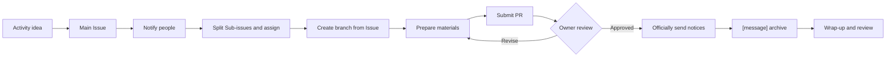

# Activities and Publicity

[中文](./README.zh.md) | English

> This directory is the entry point for activity and publicity work. Start here for the activity workflow, then open the detailed guideline you need.

> [!IMPORTANT]
> If you are not yet familiar with GitHub Issues, Sub-issues, branches, Pull Requests, or web editing, read [Quick Help for GitHub Beginners and New Members](https://github.com/BETA-SDC/community/blob/main/docs/resources/README.md#L10-L15) first.

## Which Document To Read

| Need | Document |
| --- | --- |
| Create and run an activity | This document |
| Issue titles, labels, branches, PRs | [Issue Collaboration Guidelines](./issue-collaboration-guidelines.md) |
| Activity material directory and file names | [event-proposal Repository File Naming Rules](./event-proposal-repo-naming-regulation.md) |
| Activity material preparation | [Activity Materials Preparation Guidelines](./activity-material-preparation-guidelines.md) |
| Official message archives | [Message Archive Guidelines](./message-archive-guidelines.md) |
| Sign-in and attendance statistics | [Sign-In Record Guidelines](./sign-in-record-guidelines.md) |
| Photos, videos, and media assets | [Media Capture Guidelines](./media-capture-guidelines.md) |

## Core Workflow

1. **Create the main Issue.** In the [event-proposal repository](https://github.com/BETA-SDC/event-proposal), create a `[event]` main Issue with background, owner, time and location, collaborators, and key deadlines.
2. **Notify relevant people.** In the main Issue, `@` the activity owner, publicity owner, executors, or people who need to provide resources.
3. **Split Sub-issues.** Split poster, registration form, copywriting, venue, materials, on-site execution, and media organization work into Sub-issues, then assign them.
4. **Create a branch from the Issue.** Prepare proposals, poster information, notification drafts, sign-in records, and other materials on the activity branch.
5. **Submit a Pull Request.** Link the main Issue and have the owner review time, location, registration method, public copy, and material paths before merging.
6. **Archive after sending.** After emails, group notices, or publicity copy are officially sent, create a `[message]` Sub-issue under the main activity Issue and copy the final sent version into it in full.
7. **Wrap up.** Add sign-in statistics, photo/video locations, review notes, and reusable materials after the activity.

> [!TIP]
> English is recommended for Issue titles, but Chinese is fully accepted. Series activities should include the series name, session number, and topic, such as `[event] Beta Meet 08 - The Field Experience of an Ecologist` or `[event] Beta Meet 第8期 - 王璟老师的科幻讲座`. Sub-issues must copy the parent activity name and use ` - ` to separate the task, channel, date, or other fields, such as `[task] Beta Meet 08 - The Field Experience of an Ecologist - Create poster`.

Issue title numbering is separate from repository directory naming. Activity directories continue to use `YYYY-MM-DD-SERIES-two-digit-session[-specific-topic]`, such as `2026-09-29-BETA-MEET-01-the-field-experience-of-an-ecologist`.

## Flowchart

## Create The Main Issue

The main Issue should include:

- Activity name or tentative name
- Purpose and background
- Expected time, location, and format
- Initial owner
- People who need to discuss or collaborate
- Known key deadlines
- Whether posters, registration forms, group notices, email notices, or other materials are needed

The idea does not need to be fully mature. The Issue gives the work a traceable entry point.

## Split Tasks And Prepare Materials

Good Sub-issues include:

- Poster, post, registration form, and other publicity material production
- Email, group notice, official account copy, and other text material preparation
- Venue booking, equipment confirmation, purchasing, or reimbursement follow-up
- Guest, host, photographer, and on-site execution arrangements
- Post-activity media organization, review notes, or website showcase updates

> [!IMPORTANT]
> When a poster is needed, first create a poster task Sub-issue under the corresponding main activity Issue, assign it to the executor, and @ the activity owner or publicity owner. The Sub-issue should explain the poster purpose, deadline, channel, registration link, whether specific images are needed, and how image materials should be used. Existing images, QR codes, or references should be attached to that Sub-issue.

Activity materials usually go under the academic year directory in the [event-proposal repository](https://github.com/BETA-SDC/event-proposal/tree/main/2026-2027). Directory and file naming rules are in the [event-proposal Repository File Naming Rules](./event-proposal-repo-naming-regulation.md).

## Send And Archive

After a notice, email, group message, registration reminder, or publicity copy is officially sent, create a `[message]` Sub-issue following the [Message Archive Guidelines](./message-archive-guidelines.md).

> [!IMPORTANT]
> Message archives should reflect what was actually sent. Drafts may be edited in branch files, but after official sending, create a `[message]` Sub-issue under the corresponding main activity Issue and copy the final sent version into it in full.

## Wrap Up

After the activity ends, the owner should add:

- Whether the activity was held as scheduled
- Number of participants or general feedback
- Registration, sign-in, and actual attendance statistics
- Location of photos, videos, or other materials
- Issues that need review
- Reusable templates, copy, or workflows

> [!NOTE]
> A sign-in record is more than a final attendance count. It should preserve the data source, counting rules, categorized lists, and any exception handling. If personal information is involved, keep only the fields that are actually needed for activity review.

> [!IMPORTANT]
> Activity photos and videos should be uploaded to the [Beta College Album](https://westlakeu.sharepoint.com/sites/beta-college/Album/Forms/AllItems.aspx?viewid=f4bff7b2%2Ddd12%2D43eb%2Da665%2Dd945dfd194c3), with folders organized by date and activity name. Do not leave photos or videos only in chat records or on personal devices.

## Before Merging

- [ ] Main Issue explains the activity background, owner, and relevant people
- [ ] Main Issue title and labels follow the [Issue Collaboration Guidelines](./issue-collaboration-guidelines.md)
- [ ] Concrete tasks have been split into Sub-issues and assigned to members
- [ ] Poster or publicity material tasks @ the activity owner or publicity owner
- [ ] Poster information follows the template, with registration links and image notes complete
- [ ] A corresponding branch has been created from the Issue and is being used
- [ ] Activity materials are in the correct directory
- [ ] Key information such as time, location, organizer, and registration method has been confirmed
- [ ] Pull Request links the original Issue
- [ ] Officially sent messages have been archived in Sub-issues
- [ ] If there is registration or sign-in, sign-in records are organized under `sign-in/`
- [ ] Activity photos and videos have been uploaded to the Album
