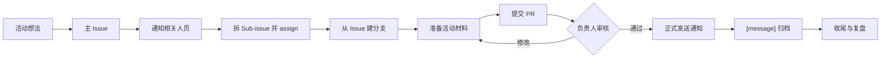

# 活动与宣传

中文 | [English](./README.md)

> 本目录是活动与宣传工作的入口。先从本文档了解活动与宣传，再按需要进入对应细则。

> [!IMPORTANT]
> 如果你还不熟悉 GitHub 的 Issue、Sub-issue、分支、Pull Request 或网页端编辑操作，请先阅读 [GitHub 新手/新成员快速帮助](https://github.com/BETA-SDC/community/blob/main/docs/resources/README.zh.md#L10-L15)。

## 先看哪份文档

| 需要做什么 | 看哪份文档 |
| --- | --- |
| 开活动、推进流程 | 本文档 |
| Issue 标题、标签、分支、PR | [Issue 协作规范](./issue-collaboration-guidelines.zh.md) |
| 活动材料目录和文件命名 | [event-proposal 仓库文件命名规范](./event-proposal-repo-naming-regulation.zh.md) |
| 正式通知归档 | [通知归档规范](./message-archive-guidelines.zh.md) |
| 签到和到场统计 | [签到记录整理规范](./sign-in-record-guidelines.zh.md) |
| 照片、视频、媒体素材 | [素材拍摄与交付规范](./media-capture-guidelines.zh.md) |

## 核心流程

1. **开主 Issue。** 在 [event-proposal 仓库](https://github.com/BETA-SDC/event-proposal)创建 `[event]` 主 Issue，说明活动背景、负责人、时间地点、协作成员和关键截止时间。
2. **通知相关人员。** 在主 Issue 中 `@` 活动负责人、宣传负责人、执行成员或需要提供资源的人。
3. **拆 Sub-issue。** 把海报、报名表、文案、场地、物资、现场执行、素材整理等明确任务拆成 Sub-issue，并 assign 给执行人。
4. **从 Issue 建分支。** 用对应 Issue 创建分支，在分支里准备活动策划案、海报信息表、通知草稿、签到记录等材料。
5. **提交 Pull Request。** PR 关联主 Issue，由负责人审核时间、地点、报名方式、公开文案和材料目录后再合并。
6. **发送后归档。** 邮件、群聊通知、公众号文案等正式发送后，在活动主 Issue 下创建 `[message]` Sub-issue，把最终发送版本完整复制进去。
7. **活动后收尾。** 补充签到统计、照片视频位置、复盘记录和可复用材料。

> [!TIP]
> 活动主 Issue 的标题只需要写清楚活动名称，例如 `[event] BETA MEET: The Field Experience of an Ecologist`。任务、通知归档和收尾等 Sub-issue 也不需要为了拆字段而强行加入连字符；只要前缀、活动归属和具体事项清楚即可。

## 流程图

## 建立主 Issue

主 Issue 至少写清楚：

- 活动名称或暂定名称
- 活动目的和背景
- 预计时间、地点和形式
- 初步负责人
- 需要参与讨论或协作的人员
- 已知的关键截止时间
- 是否需要海报、报名表、群聊通知、邮件通知等材料

想法还不成熟也可以先开 Issue。Issue 的作用是给事情一个可追踪的入口，不是证明方案已经完美。

## 拆任务和准备材料

适合拆成 Sub-issue 的任务包括：

- 海报、推文、报名表等宣传材料制作
- 邮件、群聊通知、公众号文案等文字材料准备
- 场地预约、设备确认、物资采购或报销跟进
- 嘉宾、主持人、摄影、现场执行等人员安排
- 活动后素材整理、复盘记录或官网展示更新

> [!IMPORTANT]
> 需要出海报时，应先在对应活动主 Issue 下创建海报任务 Sub-issue，assign 给执行人，并 @ 活动负责人或宣传负责人。Sub-issue 需要说明海报用途、截止时间、发布渠道、报名链接、是否有指定图片，以及图片素材的使用要求；已有图片、二维码或参考图应作为附件一起挂在该 Sub-issue 下。

活动材料通常放在 [event-proposal 仓库的学年目录](https://github.com/BETA-SDC/event-proposal/tree/main/2026-2027)下。目录和文件命名见 [event-proposal 仓库文件命名规范](./event-proposal-repo-naming-regulation.zh.md)。

## 发送和归档

通知、邮件、群消息、报名提醒或宣传文案正式发出后，按 [通知归档规范](./message-archive-guidelines.zh.md) 建立 `[message]` Sub-issue。

> [!IMPORTANT]
> 通知归档以实际发送后的内容为准。草稿可以放在分支文件中协作，但正式发送后必须在对应活动主 Issue 下开 `[message]` Sub-issue，把最终发送版本完整复制进去。

## 活动后收尾

活动结束后，负责人应补充：

- 活动是否如期举行
- 参与人数或大致反馈
- 报名、签到和实际到场统计
- 现场照片、视频或其他素材的位置
- 后续需要复盘的问题
- 是否有可复用的模板、文案或流程

> [!NOTE]
> 签到记录不是只存一个到场人数。至少应能追溯数据来源、统计口径、分类名单和异常处理方式；如果涉及个人信息，只保留活动复盘确实需要的字段。

> [!IMPORTANT]
> 活动照片和视频应上传到 [Beta College Album](https://westlakeu.sharepoint.com/sites/beta-college/Album/Forms/AllItems.aspx?viewid=f4bff7b2%2Ddd12%2D43eb%2Da665%2Dd945dfd194c3)，并按日期和活动名称整理文件夹。不要只把照片、视频留在聊天记录或个人设备中。

## 合并前检查

- [ ] 主 Issue 已说明活动背景、负责人和相关人员
- [ ] 主 Issue 标题和标签符合 [Issue 协作规范](./issue-collaboration-guidelines.zh.md)
- [ ] 具体任务已拆成 Sub-issue，并 assign 给对应成员
- [ ] 海报或宣传物料任务已 @ 活动负责人或宣传负责人
- [ ] 海报信息已按模板填写，报名链接和图片使用说明已补全
- [ ] 已从 Issue 创建并使用对应分支
- [ ] 活动材料放在正确目录下
- [ ] 时间、地点、主办方、报名方式等关键信息已确认
- [ ] Pull Request 已关联原 Issue
- [ ] 正式发送过的消息已创建 Sub-issue 归档
- [ ] 如有报名或签到，签到记录已整理并放入 `sign-in/` 目录
- [ ] 活动照片和视频已上传到 Album
